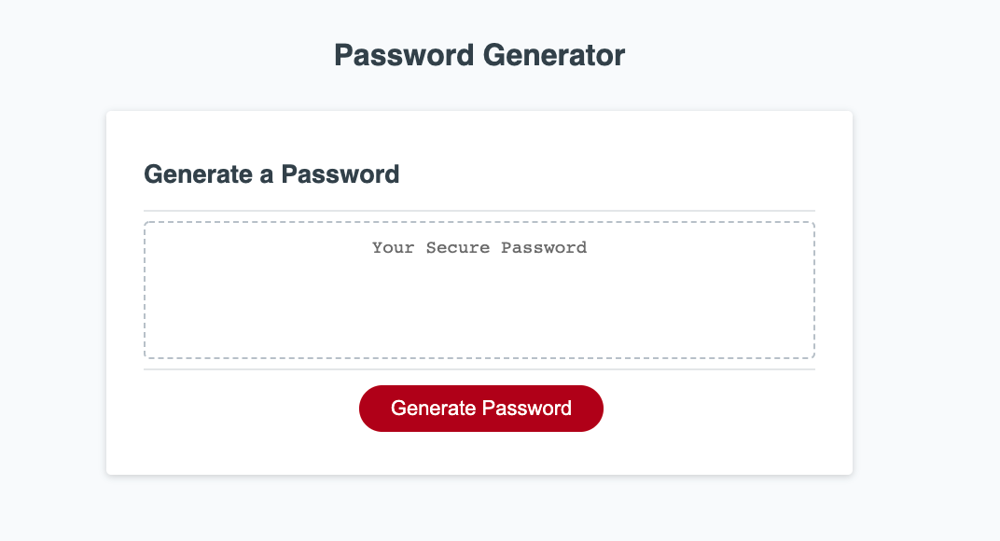
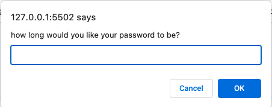
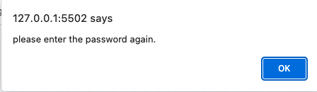
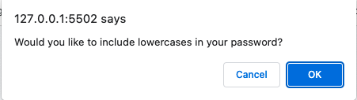
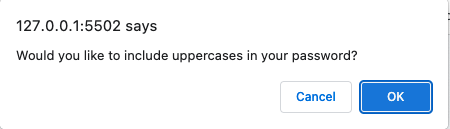
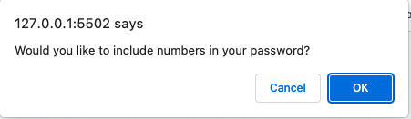
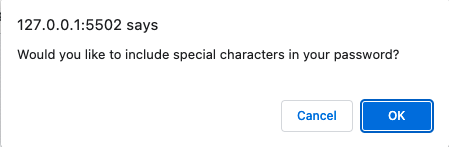
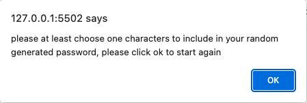
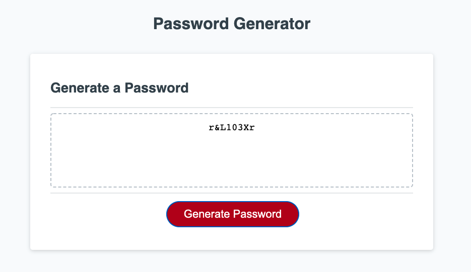

# Password-Generator

## Links to the Project

Link to the Github Repository: [https://github.com/jinyiyu/password-generator]

Link to the deployed URL: [https://jinyiyu.github.io/password-generator/]

<br>

## Description of This Project

```
This project is developed to emable users to generate random passwords based on criteria that they’ve selected. This app will run in the browser and will feature dynamically updated HTML and CSS powered by JavaScript code. It will have a clean and polished, responsive user interface that adapts to multiple screen sizes.
```

## User Story

```
AS AN employee with access to sensitive data
I WANT to randomly generate a password that meets certain criteria
SO THAT I can create a strong password that provides greater security
```

## Acceptance Criteria

```
GIVEN I need a new, secure password
WHEN I click the button to generate a password
THEN I am presented with a series of prompts for password criteria
WHEN prompted for password criteria
THEN I select which criteria to include in the password
WHEN prompted for the length of the password
THEN I choose a length of at least 8 characters and no more than 128 characters
WHEN asked for character types to include in the password
THEN I confirm whether or not to include lowercase, uppercase, numeric, and/or special characters
WHEN I answer each prompt
THEN my input should be validated and at least one character type should be selected
WHEN all prompts are answered
THEN a password is generated that matches the selected criteria
WHEN the password is generated
THEN the password is either displayed in an alert or written to the page
```

## Mock-Up

The following screenshots in the taggle list show the web application's appearance and functionality:

<details>
<summary> Live Page</summary>


</details>

<details>
<summary> Propt for password length</summary>


</details>

<details>
<summary> alert box for any unvalid input</summary>


</details>

<details>
<summary> Prompt for four Character choices</summary>





</details>

<details>
<summary> Alert box for unvalid options</summary>


</details>

<details>
<summary> Password display in the page</summary>


</details>
<br>

## Technology Used

- Visual Studio Code
- Github
- HTML
- CSS
- Javascript

<br>

## How To Contact Me

- Email: yujinyiicxk@gmail.com
- Github: https://github.com/jinyiyu
- LinkedIn: https://www.linkedin.com/in/jinyiyu/

<br>

## Authored by

### __Jinyi Yu__
